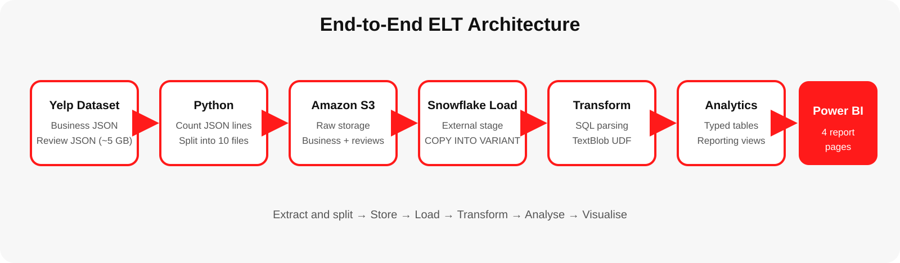
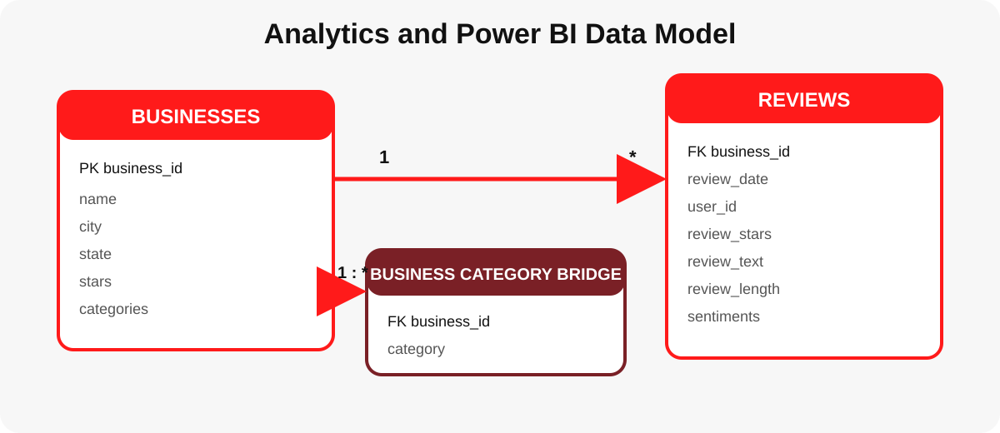
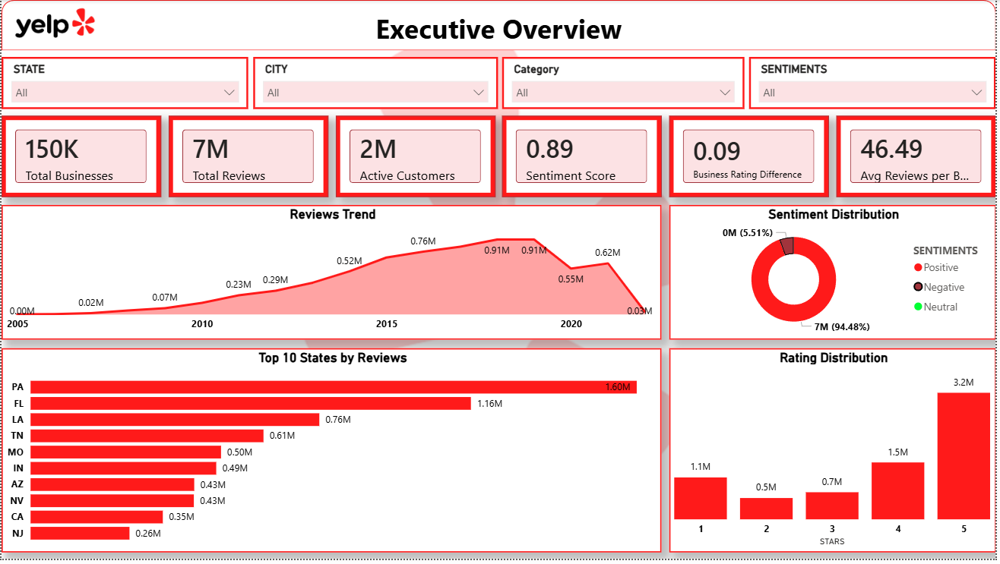
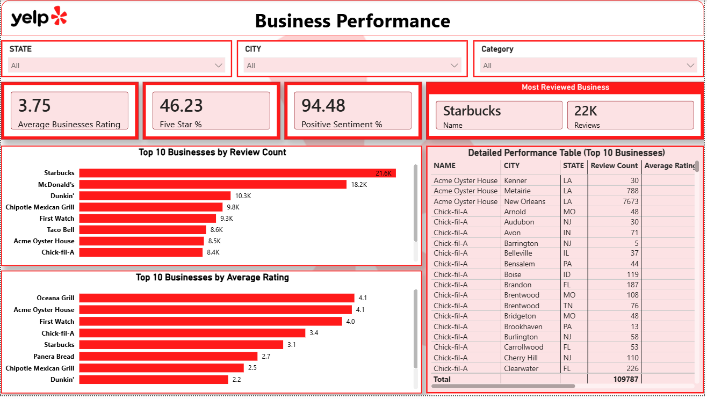
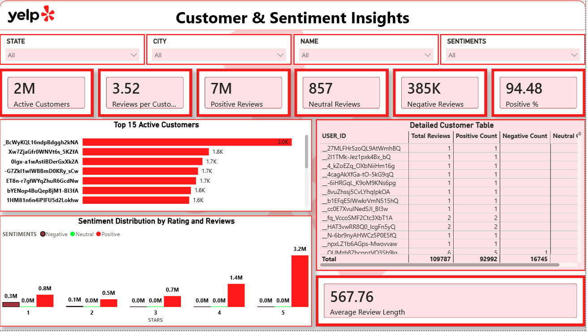
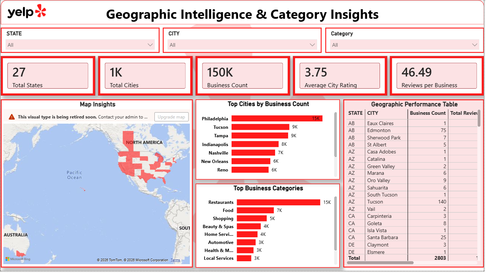

# Yelp Business Intelligence Analytics Platform ELT Project

<p align="center">
  
</p>

<p align="center">
  
  
  
  
  
</p>

## Project Overview

I built this project to create an end-to-end cloud analytics workflow for Yelp business and review data. The source files were large JSON datasets, so I first split the review file into smaller parts with Python, stored the files in Amazon S3, loaded the semi-structured JSON into Snowflake, transformed it into analytics-ready tables, applied TextBlob-based sentiment classification, performed SQL analysis, and created a four-page Power BI dashboard.

The completed solution processes:

| Dataset | Rows used in Power BI | Grain |
|---|---:|---|
| Businesses | 150,346 | One row per Yelp business |
| Reviews | 6,990,280 | One row per customer review |

> The repository intentionally excludes the multi-gigabyte raw Yelp dataset. See [`data/README.md`](data/README.md) for placement instructions.

## Business Objective

The project is designed to help business and strategy teams answer four practical questions:

1. What is the overall scale, review activity and customer sentiment across the Yelp ecosystem?
2. Which businesses receive the most reviews and maintain the strongest ratings?
3. How do customer activity, review ratings and text sentiment relate to one another?
4. Which states, cities and business categories show the highest concentration and engagement?

## Project Architecture

<p align="center">
  
</p>

```text
Yelp JSON Dataset
        ↓
Python file splitting and extraction
        ↓
Amazon S3 raw storage
        ↓
Snowflake stage and COPY INTO
        ↓
Raw VARIANT tables
        ↓
SQL transformations + Python sentiment UDF
        ↓
Analytics tables and reporting views
        ↓
Power BI dashboard
```

## Technology Stack

| Layer | Technology | Work completed |
|---|---|---|
| Source data | Yelp JSON dataset | Business and review data |
| Extraction | Python | Split the large review JSON file into smaller files |
| Cloud storage | Amazon S3 | Stored raw JSON files |
| Data warehouse | Snowflake | Loaded semi-structured JSON using stages and `COPY INTO` |
| Transformation | Snowflake SQL | Parsed JSON, cleaned fields and built analytics tables |
| NLP | Snowflake Python UDF + TextBlob | Classified review text as Positive, Neutral or Negative |
| Analysis | SQL | Category, business, customer, rating, city and sentiment analysis |
| Reporting | Power BI + DAX | Four-page interactive business intelligence dashboard |
| Version control | Git and GitHub | Reproducible code and project documentation |

## Data Model

<p align="center">
  
</p>

The Power BI model uses a one-to-many relationship:

```text
BUSINESSES[business_id]  1 ───────── *  REVIEWS[business_id]
```

A normalized business-category bridge is also included in the Snowflake scripts as a reporting enhancement.

## Power BI Dashboard

### Page 1 — Executive Overview

<p align="center">
  
</p>

Main KPIs and visuals:

- Total businesses, total reviews and active customers
- Sentiment score and business-versus-review rating difference
- Average reviews per business
- Review trend, sentiment distribution, state ranking and star-rating distribution

### Page 2 — Business Performance

<p align="center">
  
</p>

Main KPIs and visuals:

- Average business rating, five-star share and positive sentiment share
- Most reviewed business
- Top businesses by review count and average rating
- Detailed business performance table by name, city and state

### Page 3 — Customer & Sentiment Insights

<p align="center">
  
</p>

Main KPIs and visuals:

- Active customers and reviews per customer
- Positive, neutral and negative review counts
- Positive sentiment percentage and average review length
- Top active customers and sentiment distribution by rating

### Page 4 — Geographic Intelligence & Category Insights

<p align="center">
  
</p>

Main KPIs and visuals:

- Total states, cities and businesses
- Average city rating and reviews per business
- Geographic map, top cities, top categories and regional performance table

## Dashboard Snapshot Findings

The dashboard screenshots show the following rounded results:

- Approximately **150K businesses**, **7M reviews** and **2M active reviewers** were analyzed.
- TextBlob classified **94.48%** of reviews as positive, with a sentiment score of approximately **0.89**.
- Five-star reviews form the largest rating group at roughly **3.2M reviews**.
- Pennsylvania and Florida generate the highest review volumes in the state ranking.
- Starbucks, McDonald's and Dunkin' appear among the most reviewed business names.
- Philadelphia has the highest business count among the displayed cities.
- Restaurants, Food and Shopping are the largest displayed business categories.

These findings are based on the current dashboard snapshot and change when report filters are applied. The sentiment result is a lexicon-based classification and should not be treated as a manually validated ground-truth label.

## SQL Analysis Included

The Snowflake analysis answers the following questions:

1. How many businesses exist in each category?
2. Which users reviewed the most restaurant businesses?
3. Which categories receive the most reviews?
4. What are the five most recent reviews for every business?
5. Which year-month contains the highest review activity?
6. What percentage of each business's reviews are five-star?
7. Which five businesses receive the most reviews in each city?
8. What is the average rating for businesses with at least 100 reviews?
9. Which businesses receive the highest number of positive reviews?


## How to Run the Project

### 1. Download the Yelp source files

Place the source JSON files inside:

```text
data/raw/
```

Expected source names:

```text
yelp_academic_dataset_business.json
yelp_academic_dataset_review.json
```

### 2. Split the large review file

Open and run:

```text
notebooks/01_split_large_review_json.ipynb
```

The notebook creates ten smaller review JSON files and verifies that no rows were lost.

### 3. Upload files to Amazon S3

Suggested folders:

```text
s3://<your-bucket>/Yelp_business/
s3://<your-bucket>/Yelp_reviews/
```

### 4. Configure Snowflake access securely

Create an AWS storage integration in Snowflake and replace the placeholders in:

```text
sql/02_load_from_s3.sql
```

Do not place AWS access keys or secret keys inside SQL scripts.

### 5. Run the Snowflake scripts in order

```text
sql/00_setup_database.sql
sql/01_create_raw_tables.sql
sql/02_load_from_s3.sql
sql/03_create_sentiment_udf.sql
sql/04_transform_analytics_tables.sql
sql/05_create_power_bi_views.sql
sql/06_data_quality_checks.sql
sql/07_business_analysis.sql
```

### 6. Connect Power BI to Snowflake

Import the reporting views, create the relationship between businesses and reviews, and add the measures from:

```text
power-bi/dax_measures.dax
```

Apply the included theme:

```text
power-bi/yelp_theme.json
```

## Security

The original working SQL contained embedded AWS credentials. They are deliberately removed from this repository. Any credential that has previously been shared or committed should be revoked immediately and replaced with a new key or, preferably, a Snowflake storage integration. See [`SECURITY.md`](SECURITY.md).

## Limitations

- TextBlob uses lexicon-based polarity and may misclassify sarcasm, mixed opinions and industry-specific language.
- Business names are not unique; `business_id` should be used for store-level calculations.
- Large raw review text increases Power BI model size and refresh time.
- Category values should be normalized into a bridge table for accurate category-level filtering.
- The current map screenshot uses a legacy Power BI map visual; Azure Maps is recommended for future versions.
- Dashboard values are based on the loaded Yelp dataset and do not represent Yelp's internal reporting.

## Skills Demonstrated

```text
Python file processing
Large JSON handling
Amazon S3
Snowflake stages and COPY INTO
Semi-structured VARIANT data
Snowflake SQL transformations
Python UDFs in Snowflake
Text sentiment classification
CTEs and window functions
Data-quality validation
Power BI data modelling
DAX measures
Dashboard design
Business storytelling
GitHub project documentation
```

## Disclaimer

This is an independent educational portfolio project. Yelp and the Yelp logo are trademarks of Yelp Inc. This project is not affiliated with, endorsed by, sponsored by or officially connected with Yelp. The analysis uses a public Yelp dataset for learning and portfolio demonstration and does not contain Yelp internal systems, confidential information or proprietary business metrics.

## Author

**Naren Navuloori**  
Data analytics portfolio project focused on cloud ELT, Snowflake, SQL, NLP sentiment analysis and Power BI.
