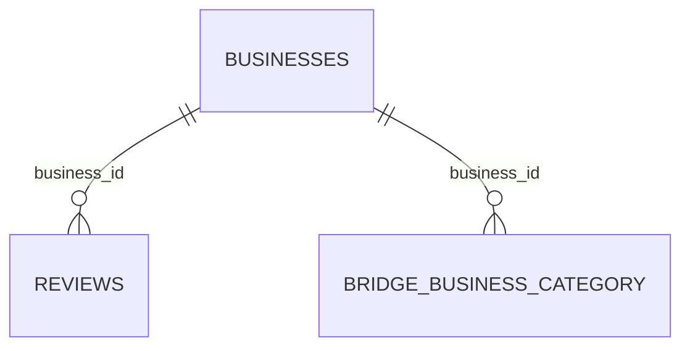

# Data Model

## Power BI Relationship



| Table | Grain | Primary analytical key |
|---|---|---|
| `BUSINESSES` | One row per business | `business_id` |
| `REVIEWS` | One row per review record | Composite source record |
| `BRIDGE_BUSINESS_CATEGORY` | One row per business-category pair | `business_id`, `category` |

## Relationship Configuration

```text
BUSINESSES[business_id]  1 ───────── *  REVIEWS[business_id]
```

Recommended Power BI settings:

- Cardinality: One-to-many
- Cross-filter direction: Single
- Active relationship: Yes
- Key used for business-level calculations: `business_id`

## Important Modelling Notes

### Business names are not unique

A name such as Starbucks or Chick-fil-A can refer to many physical businesses. Use `business_id` for ranking individual locations. Use `name` only when the objective is to group all locations under the same displayed brand name.

### Category normalization

The original `categories` field contains comma-separated values. The Snowflake transformation creates `BRIDGE_BUSINESS_CATEGORY`, where each business-category pair becomes a separate row. This enables accurate category slicers and rankings.

### Large review text

The review table contains almost seven million text records. Importing the complete `review_text` column increases the Power BI file size and refresh time. A production model would normally expose a precomputed `review_length` column and retain full text only when detailed text analysis is required.
